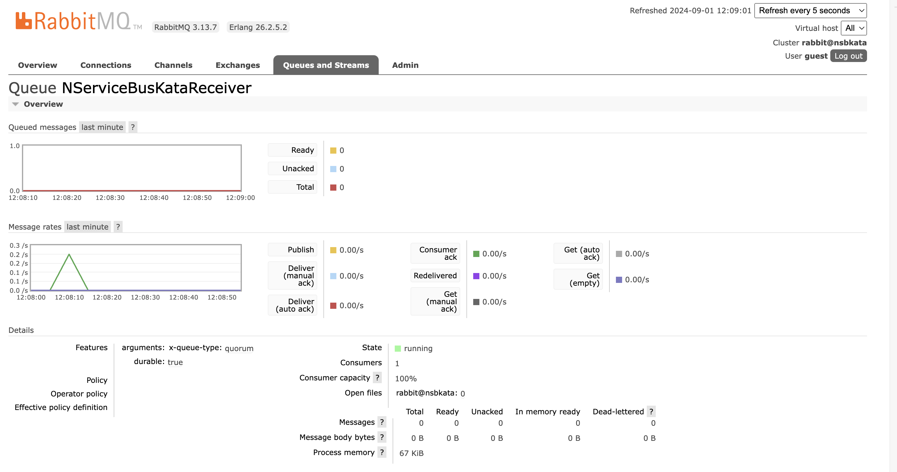

In the previous article we looked at publishing messages and the one before that sending messages. But in both cases we cheated a little bit: we used the LearningTransport. This is effectively just a directory on disk. It cannot be used as real world transport. Let's change out this transport for something more production ready.

<!--more-->

* Kata 1 - [Sending a message](https://www.westerndevs.com/_/nservicebus-kata-1)
* Kata 2 - [Publishing a message](https://www.westerndevs.com/_/nservicebus-kata-2/) 
* Kata 3 - Switching transports
* Kata 4 - [Long running processes](https://www.westerndevs.com/_/nservicebus-kata-4/)
* Kata 5 - [Timeouts](https://www.westerndevs.com/_/nservicebus-kata-5)

One of the really nice things about NServiceBus is that it abstracts away a lot of the mess of dealing with transports. You can spend less time fiddling with plumbing and more time getting to the nitty gritty of building business value. We have a lot of options for transport and the ability to write new ones if needed. The official supported transports are 

* Azure Service Bus
* Azure Storage Queues
* Amazon SQS
* RabbitMQ
* SQL Server
* MSMQ

Each of these has advantages and disadvantages which you can read about in some detail in the [documentation](https://docs.particular.net/transports/). In a production environment I'd push heavily towards Azure Service Bus but it has a major disadvantage: no local emulator. There is a github issue open to [add an emulator](https://github.com/Azure/azure-service-bus/issues/223) which has been open since 2018. Normally I'd grumble a bit about how this is never going to be solved but actually the team has dedicated resources to building one out and think they'll have one ready by the end of 2024. Only you, dear readers from the future, know if this came to fruition.

For now we're going to take advantage of the interchangeability of transports and switch out the LearningTransport for the RabbitMQ transport. This can be run with a container on docker. 

# The Kata

Take the solution developed already and switch out the learning transport for the RabbitMQ transport running inside of a container. Everything should continue to work as it did before but now using RabbitMQ.

# My Solution

1. Download and run the RabbitMQ container

```bash
docker run -d --hostname nsbkata --name nsbkata-rabbit -p 15672:15672 -p 5672:5672 rabbitmq:3-management
```

2. Install the RabbitMQ transport package in all the projects
```bash
dotnet add sender package NServiceBus.RabbitMQ
dotnet add receiver package NServiceBus.RabbitMQ
dotnet add anotherReceiver package NServiceBus.RabbitMQ
```

3. Modify the endpoint configurations across all the projects swapping 

```csharp
var transport = endpointConfiguration.UseTransport<LearningTransport>();
```

with 

```csharp
var transport = endpointConfiguration.UseTransport<RabbitMQTransport>();
transport.ConnectionString("host=localhost");
transport.UseConventionalRoutingTopology(QueueType.Quorum);
```

4. It is generally best that you take control of creating queues for NServiceBus but tooling is provided. Install that tooling 

```bash
dotnet tool install -g NServiceBus.Transport.RabbitMQ.CommandLine
```

Next create the queues for the endpoints (and the delays queues)

```bash
rabbitmq-transport delays create  -c "host=localhost"
rabbitmq-transport endpoint create NServiceBusKataAnotherReceiver -c "host=localhost"
rabbitmq-transport endpoint create NServiceBusKataReceiver -c "host=localhost"
rabbitmq-transport endpoint create NServiceBusKataSender -c "host=localhost"
```

Things to try now

1. Run the sender, receiver and anotherReceiver projects. You should see the messages being sent and received as before.

2. Log into the RabbitMQ management console(running at http://localhost:15672/ with credentials `guest`/`guest`) you should see the queues created and in fact a message processed

