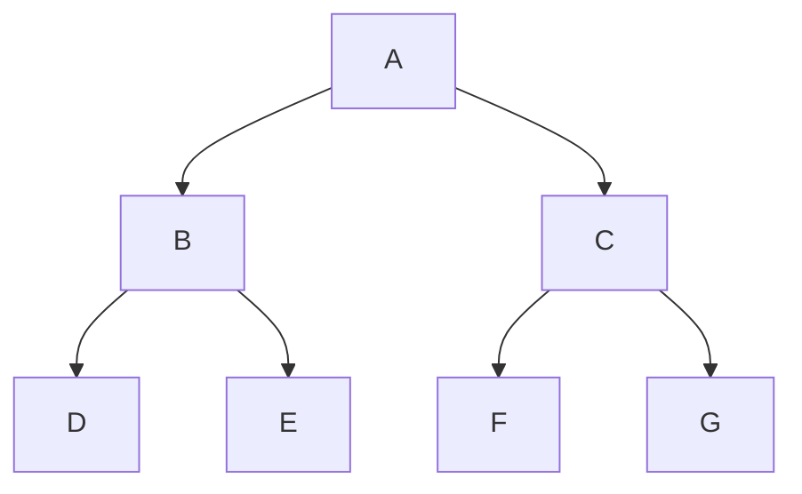

One of my team members mentioned that they envision the process flow of our code as a Plinko board. If you've never watched The Price is Right, a Plinko board is a vertical board with pegs that a contestant drops a disc down. The disc bounces off the pegs and lands in a slot at the bottom. The slots have different values and the contestant wins the value of the slot the disc lands in.

)

I just loved this mental model.  Each peg in the board is an fork in the code and a different path can be taken from that point on. It's basically an execution tree but with a fun visual that's easy to explain to people. 

